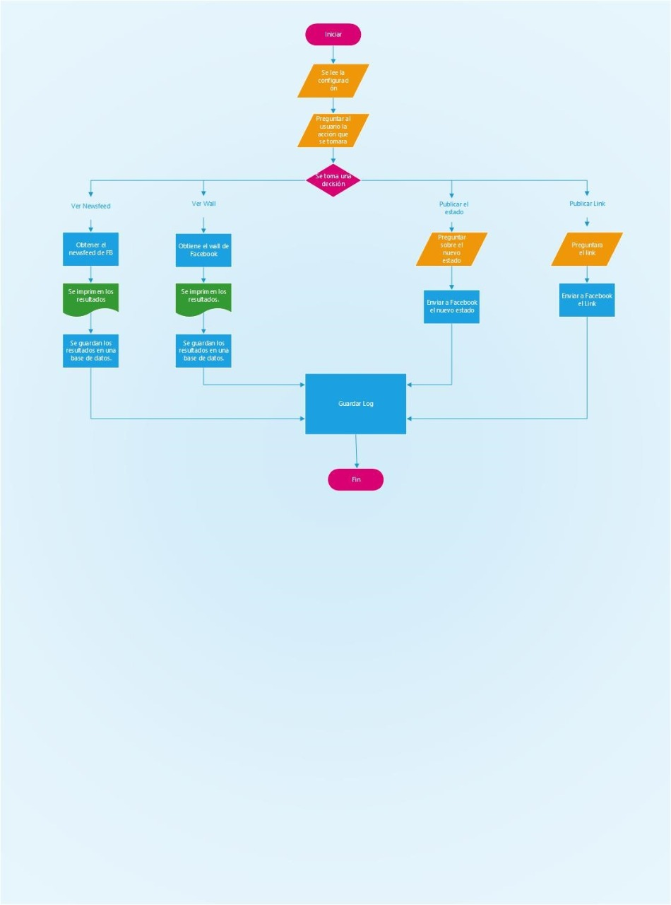

#AIMA APP

Aplicación cliente de Facebook, ejecutada en java con las siguientes opciones:

0-Publicar
1-Publicar con URL
2-Traer Home
3-Traer Feed
4-Salir

Se crearon dos clases las cuales se describen a continuacion.

aima_login: realiza la conexión a la aplicación creada previamente en facebook.
aima_app: ejecuta el proceso de acuerdo a la solicitud del usuario en base a las opciones anteriormente mencionadas.

Este es el diagrama de la aplicacion:

